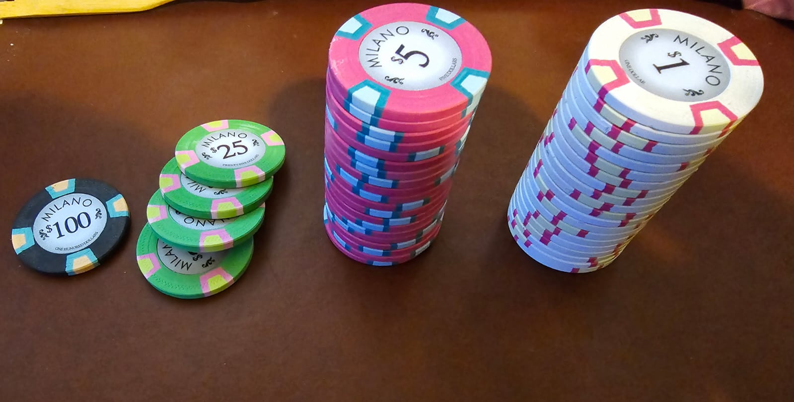
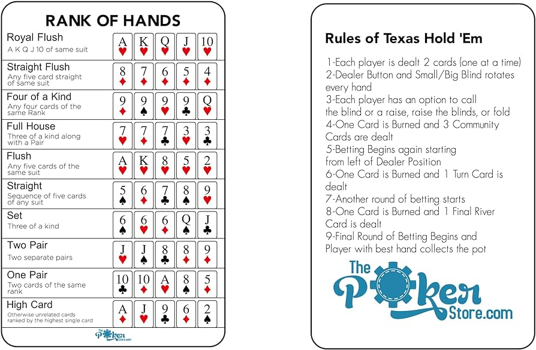

# Poker Rules

This document is the official list of rules for my home games. It is based upon [Dave's Home Poker Cash Game Rules](https://david.goodger.org/personal/poker/home-cash-game-rules.html).

# Overview

The goals of these rules are, in order of priority:
* Fun and fairness
* Simplicity and practicality
* Accuracy with Vegas casino rules

Mistakes happen! Any irregularity should be addressed with discussion and common sense in the spirit of fairness. The decisions of the floor manager (that's me!) are final.

If you are coming to my home game, you should expect to:
* Have fun! Poker is a game and win or lose, it should be fun
* Only play with money you can easily afford to lose
* Hold no grudges

## The Game: Texas No-Limit Hold'em

The game is Texas No-Limit Hold'em. Most games will be cash games, tournament variants will be described below.

### Getting Started

* For an overview of Texas Hold'em, see [wikipedia](https://en.wikipedia.org/wiki/Texas_hold_%27em) or other resources
* We play no-limit, meaning you can go all-in (bet all the money in your stack) at any time. If someone does not have enough money, they can still call up to the amount they have. This creates a side pot. Having less money never forces you to lose the hand. You can never win more money than you had in your stack from each player in the hand. For details, see "side pots" under Betting Minutiae
* We play with chips that are styled and colored to resemble casino chips. They are labeled $1, $5, $25, and $100. These chips will be assigned a value (usually 1/10th) so that a $30 buy-in gets you 300 chips, which is what you might normally sit down at a standard casino table with for a 1/3 game.
* You can top up to the table limit any time (between hands). You can leave the table any time but you cannot take some of your stack off the table, you have to leave the table for at least 2 orbits and come back to buy back in.
* The minimum buy-in is 30 BBs rounded up, and the maximum buy-in is 100 BBs. For a $0.10/$0.30 game this is $10/$30.
* There is a dealer button to show who is "the dealer" position - the actual person dealing the cards may be different. If you are new to poker, I won't make you shuffle and deal your first time unless you want to =)
* It is always ok to ask questions. Try to pay attention to the action.
* Keep your highest value chips visible so people can estimate your stack. Try to keep your stacks "clean" (same color in a stack, not mixed)
* Keep your cards visible if you are in the hand, don't cover them with your hands or put them behind your chips. If you place a card protect or a $1 chip on them, it will be clear you are still in the hand.
* Place your bets neatly in front of you, do not push them to the middle. "No Splashing Ze Pot"!
* If the action is on you and you must call a bet and do not wish to do so, then you fold. When you fold, pass your cards face down towards the dealer, and the dealer will place them "in the muck". Once cards are in the muck, your hand is dead and you are no longer able to win the pot.
* Once everyone else has folded, you win the pot. The dealer will push the pot to you and you may elect to show your cards, or pass them to the dealer face down. Some players may elect to show one card, this is allowed unless your bet was called or someone still has cards and it is your turn to show. In those cases you must show two cards to claim the pot.
* Once the betting has completed on the river and it is your turn to expose your hand, flip them over without waiting. The dealer will identify the hand verbally if it is the best hand. If another hand is shown which is better, the dealer will say something like "Flush beats straight" and put the losing hand into the muck. If you are certain your hand is beat and you were not called, you may fold your hand face down (also called "mucking"). Once all hands are in the muck except the winning hand, the dealer will award the pot and place the winning hand in the muck afterwards.

### Stakes / Chips

* Most low-stakes casino games are 1/2 or 1/3 with a $300 or $400 max buy-in. For this reason, we play 1/3 with a 300 chip buy-in, divided by ten, to yield a max buy-in of $30 but retain the "casino feel".
* The chips look like this: 
    * The three stacks on the left are all equivalent to $10: 1 x $10 chip (black), or 4 x $2.50 chip (green), or 20 x $0.50 chip (red). The stack of 20 x $0.10 chips is $2.
    * A typical starting stack would be 56 red chips ($28) plus 20 white chips ($2) for change
* New players should expect a few hours of play could involve losing multiple buy-ins. Don't play with more than you are comfortable losing. This also means luck and/or skill can result in winning a few buy-ins, which is a tidy sum!
* You can never lose more than you put on the table
* You can never be forced to put up more money because someone else has more money than you - what is on the table plays
* Just like a casino, chips are as good as cash on the table. If you need more chips, ask the banker (me) and I will sell you chips for cash. I keep all cash separately so at the end of the night people can sell their chips back for the same cash.
* There is no tipping, no rake, and nothing removes money from the game until people sell their chips back. I will always sell myself chips back last, so any mismatch is pretty much my problem, not yours.
* Chips should not leave the table or go in your pocket. The one exception is if I can't break a 20, I might give you an extra 100 chip ($10) to hold until you sell your chips back. You can place that on the table any time between hands if it does not put your stack over the max, but you cannot take it back off once you do.
* Change Hand: At the end of the night, we will do a change hand where anything that doesn't round to $1 will go in the middle, then we deal a full hand face up and the winner takes the remainder. The pot will also round to an even dollar amount and that will ensure nobody gets stupid metal money.

### Fair Play Minutiae

* Do NOT discuss what cards you had during a hand, even if you are no longer in the hand, wait until the pot is awarded to someone. Any discussion can impact the result of the hand and is unfair to those still in the hand. Try not to react obviously to the community cards for the same reason. Try not to accidentally reveal your cards while folding them. *It is your responsibility to protect your hand. If your hand is revealed it may be declared dead at the dealer's discretion*.
* Fair Play with accidentally revealed information:
    * If you are in a hand and you see a card which is a dead hand (folded), a burn card, or part of the deck, it is not only polite but required for fairness that you immediately say something. If you are certain, you can simply say the information you know.
        * Example: "I think that burn card was a club" or "Jim just mucked a 7")
        * If you do not do this, you will have an unfair advantage during the hand that is not the fault of other players in the hand.
    * If you are not in a hand and you see revealed information, you should only say something if you are sure others saw it too. Since you are not in the hand, you cannot influence the hand unfairly as long as you keep quiet =)
    * If you are in a hand, it is your job to keep your hand hidden. If you expose any part of your hand to another player who is also in the hand, they may use that information against you. This is necessary otherwise you could "accidentally" expose your hand on purpose to gain an advantage.
    * In multi-way pots, if you expose your hand intentionally your hand may be declared dead, at the discretion of the dealer. This is to prevent an unfair situation where one player has more information at the time they act than other players.
    * Once it is "heads up", (only you and one other player), you may expose one or both of your cards at any time you desire, but it is very unusual to do so and generally not in your interest. The most common way this happens is someone shows their cards after stating "I am folding, but this is what I had".

### Betting Minutiae

This stuff is just how it works in the casinos. You probably don't care about this but in case you are curious how it works, these are the rules I will enforce.

* Assuming 1/3 (small blinds 1 chip, big blinds 3 chips) - The first round, you can call the 3 chip blind or raise to 6 chips or more. On subsequent rounds, you can open for 3 chips or more up to every chip you have.
* If someone bets (or calls) 3 chips, the minimum raise is to 6 chips total. If someone opens for 10, the minimum raise is to 20. If someone calls 3 chips, and someone else raises to 10, the minimum re-raise is then to 17 (3 to 10 was 7, 17 is another 7 more).
* If someone bets 50, and the next player has 80 total and goes "all in", because 80 was not sufficient to be a min re-raise, it does not reopen the action. This means each remaining player that has not yet called 50 could choose to call 80 or re-raise higher, but the player that bet 50 may choose to call 80 but cannot re-raise higher than that.
* If someone bets 6 and you throw in a single chip without saying anything, even if it is a 100 chip, you are indicating a call. A single chip is always a call unless you say "raise". If you want it to be unambiguous, throw in a 100 and a 5 chip to make it a raise to 105.
* Verbal is *always* binding. If you say one thing, but put in too many or too few chips, the dealer will correct it by passing chips back to you or directing you to put more chips into the bet.
* When you bet, use a single forward motion. Do not place some chips out, then reach back and get more chips and put them out also. Do *NOT* do the "movie thing" and say "I see your 100, and raise you 100 more!". This is called a "string bet" and it is not allowed because you might use your opponent's reaction to decide whether or not to raise or how big of a raise to make.
* No Angling: It goes without saying, but angles are NOT fun. Angles are using deceptive or non-standard actions to try to trick another player into making a mistake (like mucking the winning hand).
* Side Pots: If multiple players are all-in but they don't have the exact same number of chips, it can create a side pot. For N players, there can be up to N-1 side pots.
    * Example: You have 120. Your opponent has 100. You go "all in". They call. The pot is 200 and you get 20 back, win or lose. The winner of the pot then gets the 200.
    * Example: Player A has 200, player B has 150, player C has 100. Player C goes "all in" for 100. Player A re-raises "all in" for 200. Player B calls. Now the main pot has 300 in it (100 from each player), the side pot has 100 in it (50 from A and 50 from B), and player A keeps their 50. The best hand of (A, B, C) wins the main pot, and the best hand of (A, B) wins the side pot. Player C cannot win the side pot because they didn't contribute to it.

### Cards / Gameplay

* The dealer (usually me) should generally try to act like a vegas dealer - this includes keeping the deck in one hand at all times with a cut card covering the bottom of the deck until the final card is dealt, indicating who the action is on, etc.
* The dealer will offer a cut to the person to the dealer button's right (the "cutoff")
* The dealer will always burn a card before dealing the flop, and again before the turn and the river.
* If a card is exposed, the dealer will show it to the table before mucking it. If it is exposed during the deal, the dealer will continue dealing the other cards where they would have gone, then will deal the card that would have burned to the person whose card was exposed, then place the exposed card on top of the deck as a "burn card".
* If more than 1 card is exposed during the deal, it is a misdeal and cards will be collected, shuffled, and redelt. The button will not move and blinds and straddles will remain in the pot.
* If you are "under the gun" (first to act, first player to the left of the big blind) and if you have not yet recieved any cards, you may post a "straddle". A straddle is a blind bet for 2x the current bet. This makes you like a third blind. You can then decide to check, raise, or fold if the action comes to you unopened. If you are UTG+1 and the UTG player straddles, you may straddle also. This continues all the way around the table.
* There are no button straddles or straddles from positions besides the first to act allowed due to the complexity of figuring out the order of action.
* Once there is no longer any action (all players are all-in) players may request to "run it twice". All must agree, otherwise we'll run it once. For a large pot, plays may also agree to run it 3 or 4 times but that's the absolute most, let's not get crazy ok?
    * "Run it twice" is a way to reduce variance, and it can be more fun. When you "run it twice", the dealer deals the remaining community cards twice as though there are two different hands. Each hand could be won by either remaining player, so the pot may end up being chopped.
    * Example: The flop is Ac Ah Tc. Player A goes all in and player B calls. Player A shows Ad Kd for a set and player B shows 9c 8c for a flush draw. Player B asks to "run it twice" and player A agrees.
        * The dealer burns a card then deals Turn one (5d), then burns a card and deals River one (Qd). Player A wins this pot with 3 Aces, K Q kicker.
        * The dealer burns another card then deals Turn two (7h), then burns a card and deals River two (2c). Player B wins this pot with a flush (Ac Tc 9c 8c 2c).
        * The dealer chops the pot between the two players.
* If a pot is chopped, and there is an odd number of chips, the extra chip goes to the first player on the dealer's left (i.e. first to act).
* If you bet or raise, and that raise was called, you must show your cards to win the pot
* If the final round checks around, first to act must show first
* If you fold to a bet, push your cards into the middle and the dealer will take them and place them into "the muck" (a face down pile of cards). Once cards are placed into the muck, they cannot be retrieved. Please try not to expose your cards when folding as it might influence future action in the hand.
* It is rude to "slow roll". Once the dealer says "show 'em", just flip both your cards over.
    * Though it is generally considered strategic not to show your cards if you don't have to - once you know you lost, you can just muck them, but honestly you almost certainly lose more money from misreading your own hand than you could possibly win by hiding information from others (like what you had and how you played it). Advice to new players is to just show your hand.
* You must show both cards to win a pot unless everyone else mucks.
* If someone is taking a long time to act, you can "call clock" on them but it is rude unless they have been taking longer than 5 minutes. Clock is 2 minutes.

### Positions and Blinds Minutiae

* Positions are named for convenience:
    * The "button" or "dealer" (B) is the person with the dealer button in front of them. Except for the first round (due to blinds), they are the last to take first action and the last to receive a card.
    * The "small blind" (SB) is the player to the dealer's left. They post the small blind and are first to act on all rounds after the first round. Action proceeds to the left from the dealer to each player still in the hand on each round.
    * The "big blind" (BB) is the player to the small blind's left. They post the big blind.
    * "Under the gun" (UTG) is the first player to act on the first round (since the SB and BB's "action" is posting blinds). UTG may elect to straddle but only before they receive their cards. To straddle, they must post 2x the big blind and it acts as a third blind. This gives them the option to check or raise when it comes around to them if nobody has raised higher than their straddle. Each subsequent position may also straddle but only if the player before them straddled, and each straddle must double the previous one.
        * Example: Player A posts SB (1 chip). Player B posts BB (3 chips). Player C posts a straddle (6). Player D posts a straddle (12). Player E calls 12. It then folds around to player A. Player A may call 12, raise to 24 or higher, or fold. If one of the remaining players raises to 24, action proceeds with no "option" to check. If nobody raises, and only calls or folds, then each next player can call, raise, or fold, except the final player who (having already put 12 into the pot) may check, raise, or fold.
    * The remaining positions are named UTG+1, UTG+2, etc. until the hijack (depending on how many players are at the table)
    * The "hijack" (HJ) is the position 2 before the button. This position is so named because it is a good position to steal the blinds from =)
    * The "cutoff" (CO) is the position right before the dealer (it is the "cutoff" where the button and blinds start)
* Position Examples:
    * Example: playing 6-handed, the positions in the order they receive cards are: SB, BB, UTG, HJ, CO, B
    * Example: playing 9-handed, the positions in the order they receive cards are: SB, BB, UTG, UTG+1, UTG+2, UTG+3, HJ, CO, B
* Missed blinds:
    * A player may stand up and walk away leaving their chips any time. In a casino, the "eye in the sky" watches your chips for you. Here, the dealer plus the assumption nobody is a thief protects your chips.
    * If you are not within arms reach of your chair when the next hand is dealt, you will not receive cards. If you are in the blinds at this time, the person to your left will post your blinds and all the positions will shift to the left.
    * You should never have to post the same blinds in two hands in a row. Each orbit you should only have to post one SB and one BB. Additionally, you should not be able to get the dealer position in an orbit before posting blinds (except the first orbit you sit down, details below).
    * If you post BB but then miss the SB, we usually don't care and just let you have the button next round because SB is too tiny to care about. There is no SB this round (because the person to your left already posted it in the prior hand and shouldn't have to again).
    * If you are UTG on the previous hand and miss posting your BB but return on the next hand, the person to your left posts BB. You can "buy the blinds" by posting SB and BB. The BB stays in front of you, the SB goes into the pot, and the person to your left is effectively UTG. Next hand, you will be the button and they will be SB (so they don't have to post any extra blinds and you effectived posted both in one turn). Alternately, you can sit out one extra hand, the button will skip you, and you can play in the CO in the next hand.
    * If you miss your turn as dealer, you just missed the most valuable position! Try not to do that but it only hurts you, nobody else.
    * If you miss multiple hands, on the hand when you would have posted BB, the dealer will put a "missed blinds" button in front of you. This means when you return you must either "buy the blinds" (paying SB and BB) or wait until the button is on your immediate left and then come in normally. (so you will play a fresh orbit, payin SB and BB in future hands before getting the button).
    * If someone goes broke the hand before their SB, the SB is "dead", nobody has to pay it. The person who would normally have posted BB still posts it.
    * If someone goes broke the hand before their BB, the person to their left is BB, the person to their right is SB, and the seat is just dead. (unless a new player wants to buy the blinds, otherwise they will wait until the button passes to start playing).
    * If someone goes broke the hand before their B, there is a "dead button". Blinds remain the same as they would have been, but the button rests on the empty spot and the person to their right is still the CO as they would have been. On the next hand, the button goes to their left.
    * If multiple people go broke at once, you adjust the blinds using dead positions as needed to make sure nobody misses their turn paying the blinds or having the button.

### Hand Rankings and Probabilities

Feel free to use this if you are new to poker.
* 

To help give you a sense for how common or rare each rank is, here are the probabilities you will have each type of hand by the river:

* Royal Flush: 0.0032% (1 in 31250)
* Straight Flush: 0.0279% (1 in 3584)
* Four of a kind: 0.168% (1 in 595)
* Full House (Boat): 2.60% (1 in 38)
* Flush: 3.03% (1 in 33)
* Straight: 4.62% (1 in 22)
* Three of a kind (Set): 4.83% (1 in 21)
* Two Pair: 23.5% (1 in 4.3)
* One Pair: 43.8% (1 in 2.3)
* No Pair (high card): 17.4% (1 in 5.7)

These are calculated from the 7-card hand probabilities in [Wikipedia: Poker probability](https://en.wikipedia.org/wiki/Poker_probability).

Note that having no pair is actually MORE RARE than having one pair! Also note that having a flush is a one in 30 situation, a boat is a one in 40 situation, and quads is a one in 600 situation. There is quite a big jump there. If you get quads or better, you should be winning the hand or writing the best bad-beat story of your life.

# Variants

## Variant: Tournament

Occasionally we will run tournaments. In these situations, the rules are slightly different than above:

* Each player that joins the tournament must stay to the end to win
* There will be a single buy-in (say, $30) and that will provide a set number of chips (example: starting stack 15,000, initial blinds 50/100)
* The blinds will gradually go up to force the action. Recommendations around blinds come from [Home Poker Tournament Blinds](https://www.homepokergames.com/home-poker-tournament-blinds.php)
* Once the tournament ends, we could do another one or return to cash game
* Depending on the number of players, a set number of places will pay out (say, 10 players means 3 places pay out).
* Because rounds are timed, even if you step away from the table you are still dealt a hand (it is a tradition not to alter the cards anyone "would have gotten"). If you are not in arms reach of your seat the first time you would have taken action, the dealer will muck your cards at that time. The dealer will also post blinds out of your stack, so you can lose money (albeit slowly) while you are gone.
* If more people are expected to join but might show up late, the tournament organizer may place some stacks on the table and treat them like an abbsent player. Then "late entrants" may take over one of these stacks.
* Example 10 person payout structure:
    * 10 people * $30 => $300
    * 1st place: 50% => $150
    * 2nd place: 30% => $90
    * 3rd place: 20% => $60
* For details, see [Home Poker Tournament](https://www.homepokergames.com/home-poker-tournament-payout-structure.php)

## Variant: PLO Double-Board Bomb Pot

Occasionally, we will have a Double-board PLO Bomb Pot. Some tables at real casinos will do this, typically once whenever the dealer changes (~once an hour). Everyone must agree to do a bomb pot. Folks can agree to allow it but sit out too, if they desire.

* Omaha
    * PLO stands for Pot Limit Omaha, which is just like Hold'em except you get 4 cards instead of 2, but you are only allowed to make your best hand using 2 of your hole cards. Due to having more cards, Omaha hands tend to get crazy and flushes, boats, and quads are much more common than they are in hold'em. A good hold'em hand might be singificantly less strong in Omaha.
    * The best starting hand in Omaha is AAKK double-suited. For example - AsAhKsKh. Now you can make trips or quads with Aces or Kings, or get the nut flush with two of the four possible suits.
    * AAAA would be a bad starting hand, because you have all 4 aces but can only use two of them. Getting a set of aces is basically impossible and a boat is unlikely unless the board has a set.
* Double-board
    * Double-board means the dealer will deal two entire boards. On the flop, the dealer will deal 3 cards to the top board (farthest from the dealer) and then the bottom board (closest to the dealer), burning before each one. Then, the normal flop betting round will happen. Next, the dealer will burn and deal two turns, then betting again, then burn and deal two rivers. It is similar to "running it twice" - if you win both boards, you win the pot. If two players each win one board, they split the pot.
    * Pot limit means the maximum bet at any time is the current pot. For example, if there is 50 in the pot, you can only bet up to 50. The next player can then raise to 100 because there is now 100 in the pot. On the river, the betting limit is removed (it becomes difficult to count the pot and usually it is big enough that all-in is legal anyways).
* Bomb pot
    * Bomb pot means everyone puts in a pre-agreed ante, typically 5-10 chips (2-4 BBs), and the dealer deals the hands and goes straight to the flop. This means the pot starts out with 20-30 BBs in it already so the limit aspect comes into play less, and people see a flop without voluntarily putting anything in to the pot.

# Poker Probability, Pot Odds, and Positional Primer

Poker is a game principally based upon two concepts: incomplete information, and probability. You do not know your opponents hands, and you do not know what community cards will come. You do, however, know various probabilities for what they might have, and what cards might come. Some general knowledge will be extremely helpful in enabling you to play better.

## Hand probabilities
* The deck has 52 cards. This means the probability of any card showing up in a given position is 1 in 52, or ~2%.
* Pocket pairs are very good starting hands. The probability of getting *any* pocket pair dealt to you is simply the probability that your second card is the same as your first. Your first card can be anything, but once you are dealt your first card there are 51 cards left in the deck and 3 of them are the same as your first card, so your chances of getting a pocket pair dealt to you are 3/51 or 5.9%, or once every 17 hands.
* The best starting hand is two aces. The probability of getting two aces as your starting hand is 1 in 221 or ~0.45%. This means you can expect to see this hand, on average, once every 221 hands. Sometimes it will be much more, sometimes it will be much less. That is natural variance.
* To understand where this comes from, there are 4 aces in the deck, so the probability of getting one ace is 4/52 or 7.6%. Each card is (supposed to be) uniformly random, so the chance of getting dealt a second ace given that you have already been dealt one ace is 3/51 or 5.9%. Thus, the probability of getting dealt two aces are 7.6% times 5.9% or 0.45%.
* The worst starting hand is 72 offsuit. This hand is the worst because off-suit means flushes are unlikely, 7 and 2 are more than 5 cards apart so unlikely to contribute to a straight, and they are the lowest cards that are that far apart so even if you get a pair (say you pair your 7) it is unlikely to be the best pair on the board.
* The probability of making a pair by the time the flop hits is ~50%. This means half of your opponents will have a pair or better. Ace high is not very good.
* This also means the probability the board will pair by the river is ~50%. If you hae a pocket pair and hit trips on the flop, you have a 50/50 shot of already having or making a boat by the river.
* You can calculate the approximate probability of various other things happening by counting your "number of outs". An "out" is a card you need. Each out gives you approximately a 2% chance for each remaining card to come.
    * Example: You have AK. The flop comes Q, 8, 2 rainbow. Your opponent has KQ, giving them a pair of queens. You can beat them if any ace or king comes, as either would give you a higher pair. There are 3 remaining kings and 3 remaining aces in the deck, so you have 6 outs. There are 2 more cards to come. So your equity (proability of winning) is approximately 6 outs * 2 cards (turn and river) * 2% => 24%. In reality, your equity is also slightly higher than that because you could also catch a "backdoor" (runner-runner) straight if a J *and* a T were to come out. We know 7 cards (your hand, your opponent's hand, and the flop) leaving 45 cards left so the probability of that is 4/45 * 4/44 => 0.8%, so you can basically ignore it.
    * Example: You have AsKs and the flop comes 2s3h4s. You are absolutely certain your opponent has either pocket 4s or A5 for the straight, meaning your only way to beat them is to catch a flush. If we assume your opponent has no spades, there are 13 spades and you have 4 of them leaving 9 available. 9 outs * 2 cards * 2% => 36% equity.
* Realistically, you don't normally know your opponents hand, but you might often suspect you are ahead (meaning you can calculate their outs) or you are behind (meaning you can calculate your outs). This can help you not only "get your money in good" (when you are ahead), but also decide if you are getting good pot odds to call. See discussion of pot odds below.

## Opening ranges and VPIP

* Premium hands are hands you should open pretty much regardless of what position you are in when playing 9-handed. Premium hands are generally considered to consist of AA, KK, QQ, JJ, AK, AQ, AJ, KQ, KJ (suited), JQ (suited). Depending on the table dynamics, you might also include down to pocket 7s, A9+(suited), KT(suited).
    * Example: The probability of getting a solid premium hand as listed above is the sum of all of the probabilities:
        * AA: 0.45%
        * KK: 0.45%
        * QQ: 0.45%
        * JJ: 0.45%
        * AK (suited or offsuit): 0.59%
        * AQ (suited or offsuit): 0.59%
        * AJ (suited or offsuit): 0.59%
        * KQ (suited or offsuit): 0.59%
        * KJ (suited): 0.15%
        * JQ (suited): 0.15%
        * 4*0.45 + 4*0.59 + 2*0.15 => 4.46% (1 in 21 hands)
        * This means we should expect to raise pre-flop ~5% of the time, or one in every 21 hands on average.
    * Example: We also want to calculate our calling range. Lets say we should call one bet with the following additional hands:
        * TT-22: 0.45% * 9
        * KJ and JQ(offsuit): 0.44% * 2
        * QT, JT: 0.59% * 2
        * suited connectors: 9Ts - 56: 0.15% * 5
        * 0.45*9 + 0.44*2 + 0.59*2 + 0.15*5 => 6.9% (~1 in 15 hands)
    * If you add these together, the hands you should either call or raise on are 11.3% or about 1 in 9 hands.
    * This means you should try to play about 1 hand per orbit on average.
    * This also means if you see someone playing a lot more than 2 or 3 hands per orbit, for multiple orbits, they are probably playing very loose. On the other hand, if you see someone playing much less than one hand per orbit, they may be playing very tightly and folding marginal hands like KQ or JTs.
* The hands you raise plus the hands you call as a percentage are often called "voluntarily put in pot" or VPIP, and by observing your VPIP or another player's VPIP over a sufficiently large sample size you can get a very good idea for how tight or loose they are playing. See [this article](https://www.blackrain79.com/2019/10/what-is-good-vpip-in-poker.html) for much more detail.

## Position

* In poker, position changes *everything*. Being in "late" position means you have a ton more information - If you are in the cutoff on a 9-handed game, and it folds around to you, you know that UTG, UTG+1, UTG+2, and the HJ all folded with a bad hand. Instead of having to beat 8 other people, you only have to beat 4 other people. You should literally play twice as many hands from this situation!
* When you add in playing more hands when in favorable position (HJ, CO, and B) your VPIP should increase from the ~11% we calculated above to more like 15%. If you are playing 6-handed, it is like you are always slightly later position, so your VPIP should be more like 20%.
* Many people prefer 6-max simply because they get to play more hands, so it is less boring!
* Another benefit of position is that you are last to act in later rounds. If you are the dealer, you are guaranteed to be last to act in every round on and after the flop. If you are CO, however, and the button folds, you are effectively as advantaged as the button was for the remainder of the hand! This is called being "in position" - if you are behind all other players in the hand. You can play more confidently when in position because you already know what other people have done when you make your choice. If they check, you can elect to check and be guaranteed to see a free card. If they bet, you can fold without putting any more money in the pot.
* Playing "out of position"
    * Similarly, playing out of position is much less advantageous, but you can still sometimes make the best of it.
        * When you are out of position, you can know that your opponents are likely to play a wider range.
        * If you have a very strong hand, you can assume your range is stronger than theirs most of the time.
        * Players in position are more likely to play aggressively or bluff at the pot.
        * You can elect to check-raise or slowplay your hand to disguise its strength.

## Pot Odds and Equity

* In poker, your goal is to "get it in good", which means to invest your chips when your equity (probability of winning) makes your expected value net positive (and thus, not to put in money that is a bad investment, because you are unlikely to win more money than you lose).
* Equity is your probability of winning - the more likely you are to win, the more you should be willing to risk. Similarly, if you are being asked to call 10 to win 100, you only have to win that one in every 10 times to be profitable.
* To calculate pot odds, you need two numbers: The total value of the pot including the opponent's bet, and the amount of additional chips you would need to call.
    * Example: There is 100 in the pot. A flop comes and your opponent bets 50. This means the pot has 150 in it, and you will need to call 50 to remain in the hand. You are getting 4 to 1.
* To calculate equity, simply convert your pot odds to a percentage. If you are getting 4 to 1, then you need to win more than 1 in 4 times to be profitable, or 25% equity.
* You can then compare this number with the math you learned in the previous section to see if you should call or not.
    * Example: You have KsQs and the flop is JsTh2s. Ace high is probably no good, but you have 9 outs to a flush (any spade) *and* 8 outs to a straight (any A or 9). 17 cards * 2% * 2 cards => 68% equity. You are actually more likely to win this hand than your opponent even if they have trips! (sorta - you would still lose if the board pairs, giving them a boat). If your opponent bets 50 into a 100 pot, you are getting 3 to 1 or 33%, your equity is almost double that, you should definitely call or even raise. If your opponent bets 80 into a 100 pot, on the other hand, the call is much more marginal. Considering only equity this round, you should fold - however, read the section on stack depth for more about that situation.
    * Example: You have JK an the flop comes J92 rainbow. You figure JJ, 99, 22, J9, J2, and 92 are all unlikely due to how the opponent played preflop, so you are probably ahead. The opponent bets 50 into a 100 pot. If they have two over cards (AK or AQ), then they could win by making either pair, meaning they have 5 or 6 outs (5 for AK since you block one king, 6 for AQ). 6*2*2 => 24%, meaning you have 76% equity. You should give them a difficult situation by re-raising. There is 150 in the pot now, so you would want to give them ~25% pot odds by making it 4 to 1. A min-reraise of 50 more would make the pot 200, giving them 5 to 1 to call. A re-raise of 75 would make the pot 225 and require 75 more to call, giving them 75/300 or 4 to 1 pot odds. If you reraised 100 more instead, that would make the pot 250 and they would need to pay 100 to call, giving them 100/350 or just under 30% pot odds. If they call with only 24% equity, this would mean they are making a mistake! You always want to put your opponent in a difficult situation if you can.

## Stack Depth

Stack depth (how much money you and your opponents have) can change what your best move is in a lot of interesting ways. You can never be forced to fold because you have less money than your opponent. On the other hand, you can never win more money than you have in front of you at the start of the hand (from each player). 
* If you are a short stack, you cannot lose more than you have in front of you
    * Example: You have 20 chips. Your opponent has 100. You open UTG for 6, and UTG+1 goes all in for 100. Your choices are to fold (losing 6), or call all-in (to a total of 20). If nobody else calls, your opponent gets 80 of their 100 bet back. If someone else with more than 100 calls, then 20 from each player is put into the "main pot" and the other two player's 80 each is put into a "side pot" which only they can win (but you cannot). In this way, they cannot force you to fold just because you have less money, and in fact, you are risking less than them so you can make a looser call when short-stacked in this position.
* If you are deep-stacked, sometimes you can push people around more without risking as much
    * Example: You have 100 chips, your opponent has 100. Your opponent opens for 6, and you go all-in for 100. Even if everyone else folds after you, your opponent has to call 14 more to win 40 total, but they will be "all in" meaning there is no future round to try to get you to fold. That call would guarantee going to show-down, so the best cards win. There is no fold equity to consider.

The "effective stack size" is the most you can be asked to commit to the pot. For example, if playing heads up and you have 100 and your opponent has 150, the effective stack size is 100 because if either person goes all-in and the other calls, only 100 chips each will be risked. Three-way (100, 150, and 200) you might say the effective stack size is 100 or 150, depending on if it goes three-way to showdown or if the middle stack folds.

Being deep-stacked means you can play hands you otherwise might not be able to play, such as suited connectors. For example, if the effective stack depth is 200+ big blinds, you can play 89 suited or 9T suited because if you hit a straight or flush, it is more likely to involve high cards where your opponent may have top pair or two pair or even a set. In that case, you can probably get stacks in and win 200+ BBs, so even if it fails a lot of the time you only need to make your hand once every 10 or 20 times for it to be profitable. On the other hand, if effective stack size is only 20BBs, then the most you can win is that - meaning you shouldn't try to draw on hands that you will only make a tiny fraction of the time. Even when you do hit your draw, it won't pay off for all the times you miss it.

# TODO

* Nothing at this time

